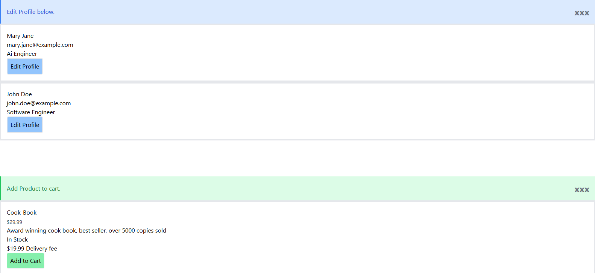

# Project Title:
Component Creation & Props

# My Solution ScreenShot:

# How to Use:

1. cd into your project folder in vscode, run npm run dev
2. app will open in defalut browser
3. you can click the blue "Edit Profile" button to display dynamic alerts for each profile
4. you can click the green "Add to Cart" button to diaplay dynamic shopping cart messages
5. click the "xxx" to the right of you screen to display dynamic exit messages

# Challenges:

1. I struggled getting Tailwind to work properly, I initially deleted the App.css and the index.css that is automatically created when you download reach + vite. I had to reCreated both files manually. Then i had to Download tailwind manually in the terminal, make some changes inside postcss.config.js and tailwind.config.js, added @tailwind base;
@tailwind components;
@tailwind utilities; inside index.css before tailwind could work. 

2. I had to go back to previous lesson on interface to remember how to create the user interface for the UserProfileCardProps interface, same with product interface for ProductDisplayProps interface.

3. Destructuring props was also a challenge i faced, I tried to do it independently but nothing was working so i had to look at the example in Lesson 2/3.

# Relection: 

1. How did you handle optional props in your components?
- I handled optional props in two main ways:
In the interfaces (index.ts):
I marked optional props with ?, 
Example: showEmail?: boolean;

- In the components (conditional rendering):
For optional booleans like showEmail, showRole, showDescription, showStockStatus,
I used conditional rendering: 
{showEmail && 
{user.email}
}
{showRole && 
{user.role}
}
{showDescription && 
{product.description}
}

- For optional callback functions like onClose, onEdit, onAddToCart,
I only rendered the button if the function existed:
{onClose && (
  <button onClick={onClose}>x</button>
)}

- For children, I just used {children} so that extra content is optional and only shows if passed in.

2. What considerations did you make when designing the component interfaces?

- Keep props focused and clear, Each component only receives what it really needs:
Example: ProductDisplay => product, showDescription?, showStockStatus?, onAddToCart?, children?

- Use objects instead of many separate fields:
For example, instead of passing name, email, role separately, I used a User object:
export interface User {
  id: string;
  name: string;
  email: string;
  role: string;
  avatarUrl?: string;
}

Then the card just gets user: User.

- Make them reusable and flexible:
  Optional booleans control what shows (showEmail, showRole, showDescription, showStockStatus).

3. How did you ensure type safety across your components?
- I Centralized all shared types in types/index.ts:
 export interface Product {
  id: string;
  name: string;
  price: number;
  description: string;
  imageUrl?: string;
  inStock: boolean;
}

export interface ProductDisplayProps {
  product: Product;
  showDescription?: boolean;
  showStockStatus?: boolean;
  onAddToCart?: (productId: string) => void;
  children?: React.ReactNode;
}

- Then imported them into the components:

import { ProductDisplayProps } from "../types";

4. What challenges did you face when implementing component composition?
- Making the callbacks line up correctly:
  for Example: 

  The interface says onEdit?: (userId: string) => void;

  The component calls onEdit(user.id)

  The parent (App.tsx) uses it like:

  onEdit={(userId) => alert(`Edit user ${userId}`)}

- Using children correctly:
  Each component supports children, so the parent can compose extra content:

- Wiring components together in App.tsx:

# Project Requirements:

Component Implementation:

Component Testing:

Component Composition:

Documentation:

# Before Starting:

1. Create a new React TypeScript project using Vite:

  - npm create vite@latest component-library -- --template react-ts
  - cd component-library
  - npm install

2. Create Folder Structure:

src/
  components/
    AlertBox/
      AlertBox.tsx
      AlertBox.test.tsx
    UserProfileCard/
      UserProfileCard.tsx
      UserProfileCard.test.tsx
    ProductDisplay/
      ProductDisplay.tsx
      ProductDisplay.test.tsx
  types/
    index.ts

# Boiler Plate Code:

- # Boiler Plate Code:Create an AlertBox component that can display different types of alerts (success, error, warning, info) with customizable messages.

// types/index.ts
export type AlertType = 'success' | 'error' | 'warning' | 'info';
 
export interface AlertBoxProps {
  type: AlertType;
  message: string;
  onClose?: () => void;
  children?: React.ReactNode;
}

- # Create a UserProfileCard component that displays user information with optional sections.

// types/index.ts
export interface User {
  id: string;
  name: string;
  email: string;
  role: string;
  avatarUrl?: string;
}
 
export interface UserProfileCardProps {
  user: User;
  showEmail?: boolean;
  showRole?: boolean;
  onEdit?: (userId: string) => void;
  children?: React.ReactNode;
}

- # Create a ProductDisplay component that shows product information with configurable display options.

// types/index.ts
export interface Product {
  id: string;
  name: string;
  price: number;
  description: string;
  imageUrl?: string;
  inStock: boolean;
}
 
export interface ProductDisplayProps {
  product: Product;
  showDescription?: boolean;
  showStockStatus?: boolean;
  onAddToCart?: (productId: string) => void;
  children?: React.ReactNode;
}

# acknowledgement

https://www.youtube.com/watch?v=SqcY0GlETPk

https://ps-lms.vercel.app/curriculum/se/415/lesson-1

https://ps-lms.vercel.app/curriculum/se/415/lesson-2

https://ps-lms.vercel.app/curriculum/se/415/lesson-3

https://ps-lms.vercel.app/curriculum/se/413/lesson-2

https://ps-lms.vercel.app/curriculum/se/413/lesson-1